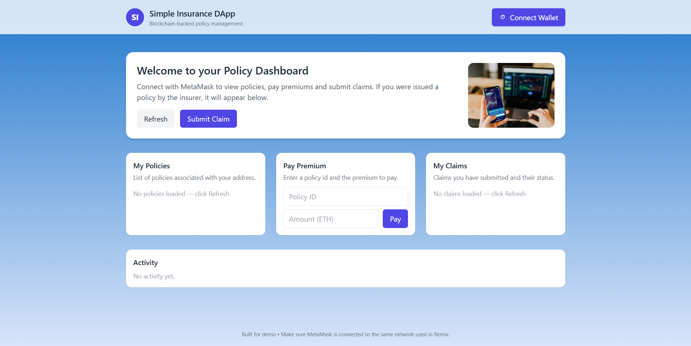
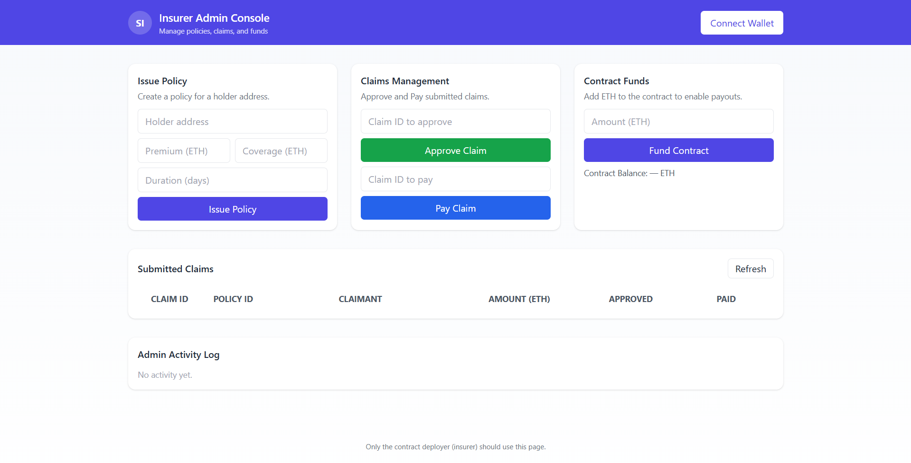

# Insurance DApp (Sepolia Testnet)

A sample decentralized application built with Ethereum smart contracts to demonstrate a basic insurance flow. This project uses **HTML**, **CSS**, **JavaScript**, and a **Solidity** smart contract deployed on the **Sepolia test network**.

---

## Screenshots

### User Interface Screens

#### Index Page


#### Admin Panel


---

## Features

- **Insurer** can create an insurance policy.
- **Policyholder** can:
  - Pay premium
  - Submit a claim
- **Insurer** can approve claims and issue payouts.
- Both insurer and policyholder must connect via **MetaMask** with **separate wallets**.
- Built for learning and demonstration purposes.

---

## Tech Stack

- **Frontend**: HTML, CSS, JavaScript  
- **Smart Contract**: Solidity (`contracts/insurance.sol`)  
- **Blockchain Network**: Ethereum Sepolia Testnet  
- **Wallet**: MetaMask (recommended)

---

## Setup & Requirements

1. **Install MetaMask** and connect to the Sepolia test network.  
2. Ensure your MetaMask accounts have enough **Sepolia ETH** (use a faucet).  
3. Serve the project with a static server (e.g. VSCode Live Server, Python server, or `http-server`).

---

## Contract Deployment (Remix IDE recommended)

1. Open `contracts/insurance.sol` in Remix.
2. Compile the contract.
3. Select **Injected Web3** (MetaMask) with Sepolia network.
4. Deploy the contract.
5. Copy the **contract address** and **ABI** from Remix.

---

## IMPORTANT: Update `contractabi.js`

In `contractabi.js`, replace these fields with your deployment values:

```javascript
const contract_address = "YOUR_DEPLOYED_CONTRACT_ADDRESS";

const contract_abi = [
  // Paste the ABI JSON here from Remix
];
